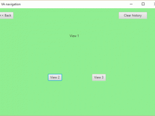

# VAnavigation
The sample application demonstrates navigation between screens (views) in JavaFX.

This pattern allows you to:
 - load(String sUrl) //file.fxml
 - GoBack()
 - ClearHistory()

Moreover, it is possible to transfer data between the screens.

Visit [my blog](http://vaprog.blogspot.ru/2016/10/vanavigation-javafx.html) for more information
